# Ticket City Platform Documentation

## Overview

Ticket City is a decentralized ticketing platform built on blockchain technology that aims to solve common problems in the event ticketing industry such as fraud, scalping, and lack of transparency. The platform leverages smart contracts to create a trustless environment where event organizers and attendees can interact with confidence.

The platform utilizes two key blockchain technologies to enhance security and usability:

1. **Soulbound NFT Tickets**: Each ticket is represented as a non-transferable (soulbound) NFT, preventing unauthorized reselling and ensuring tickets remain with their original purchasers.

2. **Stablecoin Payments**: The platform exclusively uses ERC20 stablecoins for all transactions, providing price stability for both organizers and attendees while maintaining the benefits of blockchain-based payments.

The platform has been implemented using the Diamond Proxy pattern for enhanced modularity, upgradeability, and gas efficiency.

## Core Features

### Event Management

- **Event Creation**: Organizers can create events with details including title, description, image, location, start/end dates, and expected attendance.
- **Ticket Types**: Support for different ticket categories (FREE, REGULAR, VIP) with varying price points.
- **Stablecoin Support**: Multiple ERC20 stablecoins can be supported for payments.
- **Revenue Management**: Automated release of revenue to organizers after successful events.

### Trust & Security Mechanisms

- **Staking System**: Event organizers provide an initial stake when creating paid events, with additional stake required when creating tickets. The stake amount is calculated based on ticket price and expected attendance.
- **Merkle-based Attendance Verification**: Organizers set a Merkle root for attendees, and attendees verify their presence by providing a valid Merkle proof.
- **Flagging System**: Ticket holders can flag events as fraudulent after they end, providing reasons for the flag. There is a 4-day flagging period after event conclusion.
- **Dispute Resolution**: Organizers can request manual review with explanations if their event is heavily flagged. The platform owner can manually confirm events as scams after investigation.
- **Reputation Tracking**: The system tracks both successful events and scam events per organizer, which affects future staking requirements.
- **Organizer Blacklisting**: The platform maintains a blacklist of fraudulent organizers who are prevented from creating new events.

### Advanced Anti-Fraud Measures

- **Soulbound NFT Tickets**: Non-transferable tickets prevent unauthorized reselling and secondary markets.
- **Stablecoin-Based Payments**: Using stablecoins provides price stability and auditability for all transactions.
- **Simple Flagging Mechanism**: Any ticket holder can flag an event with a reason if they believe it was fraudulent.
- **Time-Limited Flagging**: Flags must be submitted within 4 days of the event ending.
- **Attendance Verification**: Merkle-proof based attendance verification ensures only legitimate attendees are counted.

## Architecture Overview

The project implements the Diamond Proxy pattern, which provides several advantages:

- **Modularity**: Functionality is separated into logical facets
- **Upgradeability**: Individual facets can be upgraded without affecting the entire system
- **Gas Efficiency**: Only deployed facets contribute to contract size
- **Storage Management**: Shared storage layout across all facets

### Diamond Pattern Implementation

The Ticket City platform uses the Diamond Standard (EIP-2535) with the following components:

1. **Diamond Proxy**: The main entry point that delegates calls to the appropriate facets
2. **Facets**: Specialized modules that implement specific functionalities
3. **Diamond Storage**: Shared storage pattern across all facets
4. **Diamond Loupe**: Functionality to introspect the diamond

### Core Facets

The platform's functionality is distributed across several facets:

1. **EventManagementFacet**: Handles event creation and management
2. **TicketManagementFacet**: Manages ticket creation, types, and purchasing
3. **TokenManagementFacet**: Manages supported ERC20 stablecoins for payments
4. **RevenueManagementFacet**: Handles revenue release, refunds, and scam event processing
5. **FlaggingFacet**: Implements the event flagging system
6. **OwnershipFacet**: Implements the IERC173 interface for ownership management

## Key Components In Detail

### Event System

Events in Ticket City are created by organizers who define parameters such as:

- Event title, description, and image URI
- Physical location
- Start and end dates
- Expected number of attendees
- Ticket type (FREE or PAID)
- Payment stablecoin (for PAID events)

For PAID events, organizers must provide an initial minimal stake, with additional stake required when creating tickets. This stake amount varies based on the organizer's reputation score and past performance.

```solidity
function createEvent(
    string memory _title,
    string memory _desc,
    string memory _imageUri,
    string memory _location,
    uint256 _startDate,
    uint256 _endDate,
    uint256 _expectedAttendees,
    LibTypes.TicketType _ticketType,
    IERC20 _paymentToken
) external nonReentrant returns (uint256)
```

The platform also provides several methods to fetch events:

- Get events without tickets for a user
- Get events with tickets for a user
- Get all valid events with available tickets

### Ticketing System

Once an event is created, organizers can define different ticket types:

- **FREE tickets**: No cost to attendees
- **REGULAR tickets**: Standard paid admission
- **VIP tickets**: Premium paid admission at a higher price point

Each ticket is represented as a soulbound (non-transferable) NFT, providing verifiable ownership while preventing ticket scalping and unauthorized transfers. The `Ticket_NFT` contract enforces this non-transferability by overriding the `_update` function to revert when attempted transfers occur between non-zero addresses:

```solidity
function _update(address to, uint256 tokenId, address auth) internal override returns (address) {
    address from = _ownerOf(tokenId);

    // Allow minting (from = address(0)) and burning (to = address(0))
    // But prevent transfers between non-zero addresses
    if (from != address(0) && to != address(0)) {
        revert("Non-transferable: Ticket cannot be transferred");
    }

    return super._update(to, tokenId, auth);
}
```

This approach ensures tickets remain with their original purchasers, effectively eliminating secondary markets and unauthorized reselling.

```solidity
function createTicket(
    uint256 _eventId,
    LibTypes.PaidTicketCategory _category,
    uint256 _ticketFee,
    string memory _ticketUri
) external nonReentrant returns (bool success_)
```

The platform stores ticket information in dedicated structures and provides methods to track the ticket types owned by users.

### Stablecoin Management System

The platform supports multiple ERC20 stablecoins for payments, with the following functionality:

- Adding supported tokens (admin only)
- Removing supported tokens (admin only)
- Checking if a token is supported
- Getting the list of all supported tokens

```solidity
function addSupportedToken(address _tokenAddress) external onlyOwner returns (bool success)
function removeSupportedToken(address _tokenAddress) external onlyOwner returns (bool success)
function isTokenSupported(address _tokenAddress) external view returns (bool isSupported)
function getSupportedTokens() external view returns (address[] memory tokens)
```

This allows for flexibility in payment options while maintaining control over which stablecoins are accepted.

### Staking & Merkle-based Attendance System

The platform's staking mechanism has been simplified in the current implementation:

- New organizers provide a fixed initial stake (10e6 units of the stablecoin) when creating a paid event
- Additional stake is calculated when creating the first ticket, based on expected attendance and ticket price
- The stake serves as economic collateral for potential refunds if an event is determined to be fraudulent

Attendance verification uses a Merkle tree system that provides cryptographic proof of attendance:

1. Organizers set a Merkle root for attendees using `setEventMerkleRoot()`
2. Attendees verify their attendance by providing a valid Merkle proof using `verifyAttendance()`
3. The platform can check if an address is whitelisted using `isAddressWhitelisted()`

```solidity
function setEventMerkleRoot(uint256 _eventId, bytes32 _merkleRoot) external
function verifyAttendance(uint256 _eventId, bytes32[] calldata _merkleProof) external
function isAddressWhitelisted(uint256 _eventId, address _address, bytes32[] calldata _merkleProof) external view returns (bool)
```

This verification system increases the integrity of attendance tracking, which is crucial for determining event success rates and processing revenue release.

### Flagging & Dispute Resolution

The platform implements a straightforward system to handle disputes:

#### Flagging System

Attendees can flag events as fraudulent after they end, with these key characteristics:

- Flags must be raised within a defined period after the event (4 days as defined in LibConstants.FLAGGING_PERIOD)
- Each flag requires a reason explaining why the event is considered fraudulent
- Only users who purchased a ticket can flag an event
- Currently, all flags have equal weight (1)

```solidity
function flagEvent(uint256 _eventId, string calldata _reason) external
```

#### Dispute Resolution

The dispute resolution process includes:

1. **Attendance-based checks**: Events with attendance rate below 70% require waiting through the flagging period
2. **Flag percentage threshold**: If the flagged percentage exceeds 70% of users who did not verify attendance, revenue cannot be automatically released
3. **Manual review request**: Organizers can request manual review and provide evidence to contest flags
4. **Admin decision**: The platform owner can confirm events as scams after investigation

```solidity
function requestManualReview(uint256 _eventId, string calldata _explanation) external
function confirmEventAsScam(uint256 _eventId, string calldata _details) external
```

## Revenue Management

Revenue from ticket sales is held in escrow until the event concludes successfully. The current release logic includes:

- Event must have ended
- If attendance rate is below minimum threshold (70% as defined in LibConstants.MINIMUM_ATTENDANCE_RATE), there's a waiting period (flagging period)
- Flagging threshold must not be exceeded
- Revenue must not have been already released
- Event must not be confirmed as a scam

The system provides several revenue-related functions:

```solidity
function releaseRevenue(uint256 _eventId) external nonReentrant
function manualReleaseRevenue(uint256 _eventId) external
function checkReleaseStatus(uint256 _eventId) external view returns (bool canRelease, uint8 reason)
function canReleaseRevenue(uint256 _eventId) external view returns (bool canRelease, uint256 attendanceRate, uint256 revenue)
```

For events confirmed as scams, a refund mechanism exists:

```solidity
function claimScamEventRefund(uint256 _eventId) external nonReentrant
function checkRefundEligibility(uint256 _eventId, address _user) external view returns (bool canClaim, uint256 refundAmount, bool alreadyClaimed)
```

When an event is confirmed as a scam:

1. The platform takes 10% of the staked amount
2. The remaining 90% is divided among ticket holders
3. Ticket holders can also get refunds of their ticket purchase amounts

## Platform Constants

The platform behavior is governed by several constants defined in LibConstants:

- `MINIMUM_ATTENDANCE_RATE`: 70% of registered attendees must verify their attendance for automatic revenue release
- `FLAGGING_THRESHOLD`: 70% of the remaining percentage of people who did not verify attendance (specialized calculation)
- `FLAGGING_PERIOD`: Period after event when flags can be submitted (4 days)
- `SCAM_CONFIRM_PERIOD`: Period during which an event can be confirmed as a scam (30 days)
- `FREE_TICKET_PRICE`: Fixed at 0

## Ticket City Process Flow
 ```mermaid
graph TD
    subgraph "Event Creation Flow"
    A[Organizer] -->|Creates Event with<br>ERC20 stablecoin| B[Ticket_City Contract]
    B -->|Collects Initial Stake| C[Stake Management]
    B -->|Creates Event Record| D[Event Storage]
    A -->|Creates Tickets| B
    B -->|Deploys| E[Soulbound NFT Contract]
    B -->|Sets| F[Ticket Types]
    F -->|FREE| G[Single Ticket Type]
    F -->|PAID| H[Regular/VIP Options]
    B -->|Collects Additional Stake| C
end
```

## Ticket Purchase Flow


## Attendance Verification Flow


## Revenue Release Flow

```mermaid
    graph TD
    A[Event Ends] -->|Starts| B[Waiting Period]
    B -->|Check| C{Attendance Rate ≥ 70%?}
    C -->|Yes| D{Flagging Threshold Met?}
    C -->|No| E{Flagging Period Ended?}
    E -->|Yes| D
    E -->|No| F[Cannot Release Yet]
    D -->|No| G[Release Revenue to Organizer]
    D -->|Yes| H[Revenue Locked for Review]
    H -->|Owner Reviews| I{Confirm as Scam?}
    I -->|Yes| J[Enable Refunds]
    I -->|No| G
```


## Flagging and Dispute Flow


### For Event Organizers

1. **Create an event** by providing details and paying an initial stake
2. **Create ticket types** for the event (FREE, REGULAR, VIP)
3. **Set the Merkle root** for attendance verification
4. **Monitor attendance** as the event progresses
5. **Release revenue** after the event concludes successfully or **dispute flags** if necessary

### For Attendees

1. **Purchase tickets** for desired events
2. **Attend the event** and verify attendance with Merkle proof
3. **Flag events** if they were fraudulent or didn't deliver as promised
4. **Claim refunds** if the event is confirmed as a scam

### For Platform Owner

1. **Manage supported stablecoins** by adding or removing ERC20 tokens
2. **Review flagged events** requiring manual validation
3. **Confirm or reject** events as scams based on evidence
4. **Manually release revenue** in special cases
5. **Transfer ownership** of the platform if needed

## Upgrade Considerations

Since the system follows the Diamond Proxy pattern, the following upgrade considerations apply:

1. New facets can be added to extend functionality
2. Existing facets can be upgraded to fix bugs or enhance features
3. Storage layout must be preserved across upgrades
4. Access control should be carefully managed, with only authorized addresses allowed to perform upgrades

## Security Measures

The platform implements several security measures:

- `ReentrancyGuard` to prevent reentrancy attacks
- Validation checks for all inputs
- Economic incentives aligned with honest behavior
- Timelocks and waiting periods before sensitive actions
- Error handling with custom error types
- Merkle proofs for secure attendance verification
- SafeERC20 for secure token transfers

## Future Extensions

The system is designed to be extensible with potential future features including:

- Enhanced reputation system with more granular rewards and penalties
- Integration with external identity verification systems
- Enhanced analytics and reporting features
- Support for recurring events and subscription models
- Secondary market functionality with controlled resale parameters
- Cross-chain deployment support

## Conclusion

Ticket City leverages blockchain technology and the Diamond Proxy pattern to create a robust, upgradeable platform for ticketing that addresses the common issues of fraud, scalping, and lack of transparency in the traditional ticketing industry.

The platform's implementation of soulbound NFT tickets forms a critical anti-scalping measure, as these non-transferable tokens ensure that tickets cannot be resold on secondary markets, maintaining fair access and pricing for all attendees. This represents a significant improvement over both traditional ticketing systems and earlier blockchain ticketing platforms that used transferable tokens.

Simultaneously, the exclusive use of ERC20 stablecoins for all payments provides price stability in a typically volatile cryptocurrency environment, making the platform more accessible to mainstream users and event organizers who may be concerned about price fluctuations. This stablecoin implementation also enables more predictable revenue planning for event organizers.

Through its combination of soulbound NFTs, stablecoin payments, and mechanisms like staking, flagging, and dispute resolution, Ticket City aligns incentives to encourage honest behavior from all participants while providing the security and transparency benefits of blockchain technology.
